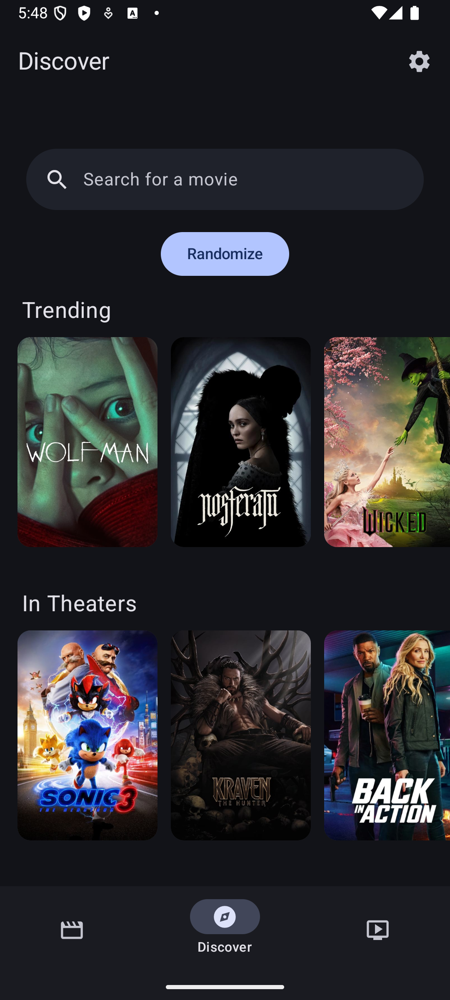
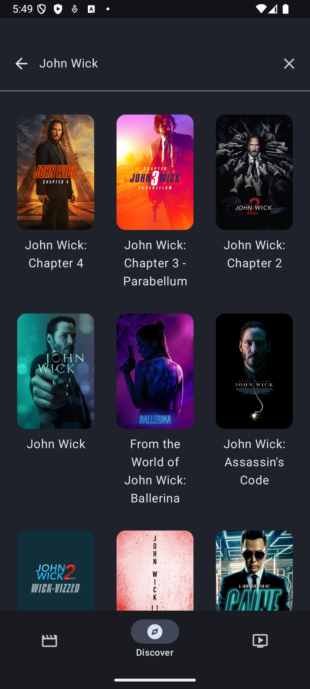
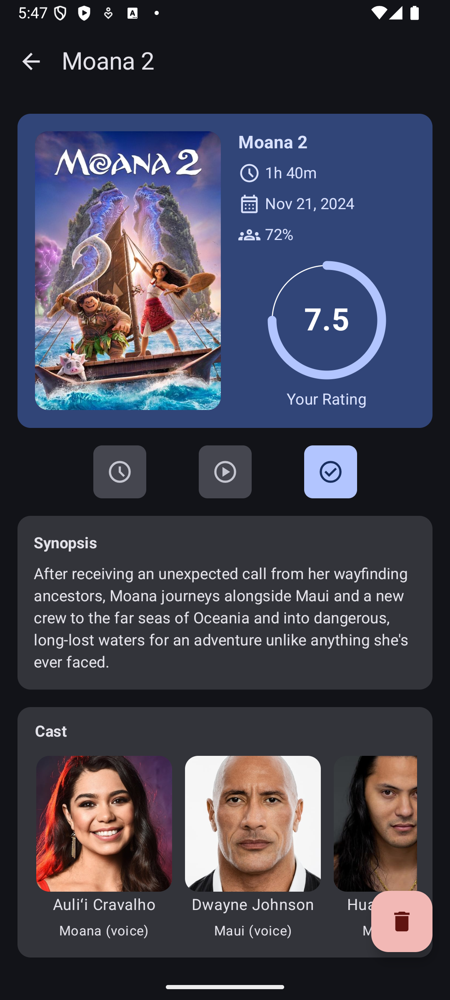
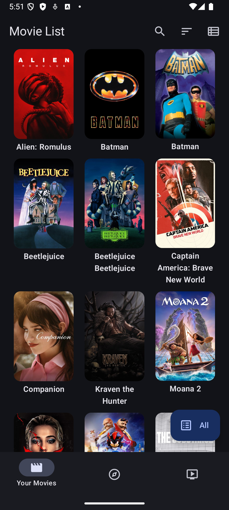
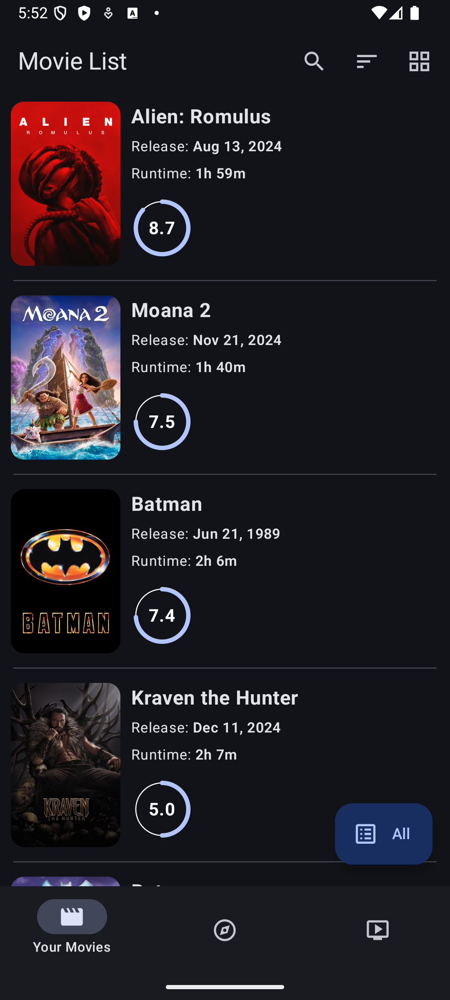

# Movie Tracker
- Android app to track and rate movies.
- Room database, Jetpack Compose, and Kotlin
- Utilizes TMDB for online search queries and media information
- Follows Google's material design 3 UI guidelines 

 Discover Screen           | Search Results            | Detail Screen
:-------------------------:|:-------------------------:|:-------------------------:
  |    |   

 Movie List                | Detail Movie List         | Settings
:-------------------------:|:-------------------------:|:-------------------------:
   |     |  
